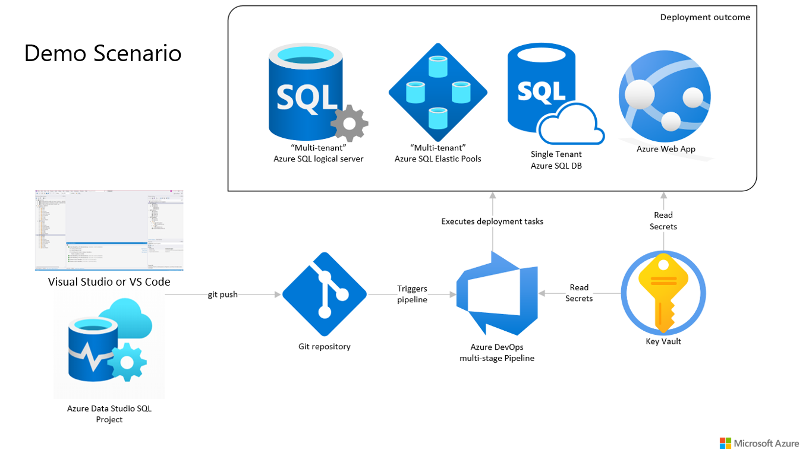
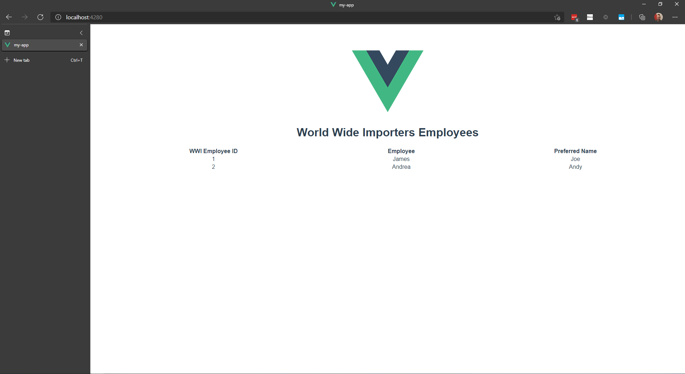

# Azure DevOps with Azure SQL and Azure Static Web App
This repository contains an example static web app and Azure SQL database along with a complete Azure DevOps pipeline definition to deploy the full stack.



## Repository Overview
- 📁 **.devcontainer**: Codespaces/VS Code remote environment definition
- 📁 **.vscode**: VS Code workspace settings
- 📁 **api**: web application API (Azure Function)
- 📁 **devops**: pipeline definition yml
- 📁 **my-app**: web application front end (Vue.js)
- 📁 **sql**: Azure SQL database project (sqlproj)

### Editing the SQL Project
Open the .sqlproj in Azure Data Studio (with the [SQL Database Projects](https://aka.ms/azuredatastudio-sqlprojects) extension) or in Visual Studio (with the Data storage and processing workload).

### Editing the web application and API
Open the full repository folder in VS Code, Visual Studio, or GitHub Codespaces.

## Azure DevOps Pipeline Recap
- *trigger* on push to main
- *variables* set on pipeline and pulled from a *group* [linked to Azure key vault](https://docs.microsoft.com/azure/devops/pipelines/library/variable-groups#link-secrets-from-an-azure-key-vault)
- *Database* stage run on the `windows-latest` image
    - Create and configure Azure SQL logical server
    - Create Azure SQL Elastic Pool and Database
    - Build DACPAC from SQL Database Project
    - Publish SQL Project output as Azure DevOps artifacts
    - Download the artifacts
    - Deploy Azure SQL DB
- *WebApp* stage run on the `ubuntu-latest` image
    - Deploy static web app
    - Set static web app DB connection string

## Running/Testing the Application Code
💻 For the best experience testing the application code, build and run the components from the command line.  This enables the front end and API to be coordinated with the [Azure Static Web App CLI](https://github.com/Azure/static-web-apps-cli).

### Build Static Web App
```
cd my-app
npm run-script build
```
This compiles the web app and places the production version in ./my-app/dist

### Build the Azure Function(s)
```
cd api
tsc
```

### Add Test Connection Settings
To test the static web app and API locally with an Azure SQL database, we need to add the connection string to our Azure Function project.  In the **api** folder, add a file `local.settings.json` with these contents:
```json
{
  "IsEncrypted": false,
  "Values": {
    "AzureWebJobsStorage": "",
    "FUNCTIONS_WORKER_RUNTIME": "node",
    "AZURESQL": "servernamehere",
    "AZURESQL_DB": "databasenamehere",
    "AZURESQL_USER": "sqlusernamehere",
    "AZURESQL_PASSWORD": "yourpasswordhere"
  }
}
```
*Note: the Azure SQL server address is appended to the server name, you will omit .database.windows.net from the settings.*

### Start the Static Web App Emulator
`swa start ./my-app/dist --api ./api`

After the app has started up, it should be available in the browser at localhost:4280

